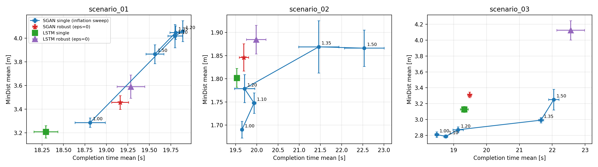

# 実験レポート: 分布情報と保守性の分離（★1）

- コミット: `63352d4d62d740ae13962eb76f64fae5bf7feaa5`
- ラン数: 480（シナリオ×条件あたり 20–20 シード）
- プロトコル: 3シナリオ × seeds 0..19、visualization 無効、Welch 両側 t 検定。評価メトリクス（MinDist/TTC/collision、ego_radius=1.0 m）は全条件共通で、プランナの feasibility 判定のみを操作。

## Sanity: 挙動保存チェック（旧 PoC 出力との per-seed 照合）

- scenario_01 sgan_single_inf1.00 ↔ 旧 baseline_single (n=20): max|Δ|=0.00e+00 → **PASS**
- scenario_01 sgan_robust_eps0.0 ↔ 旧 da_eps0.0 (n=20): max|Δ|=0.00e+00 → **PASS**
- scenario_02 sgan_single_inf1.00 ↔ 旧 baseline_single (n=20): max|Δ|=0.00e+00 → **PASS**
- scenario_02 sgan_robust_eps0.0 ↔ 旧 da_eps0.0 (n=20): max|Δ|=0.00e+00 → **PASS**
- scenario_03 sgan_single_inf1.00 ↔ 旧 baseline_single (n=20): max|Δ|=0.00e+00 → **PASS**
- scenario_03 sgan_robust_eps0.0 ↔ 旧 da_eps0.0 (n=20): max|Δ|=0.00e+00 → **PASS**

## 条件別サマリ（mean±std）

### scenario_01

| condition | n | Time [s] | MinDist [m] | MinTTC [s] | 衝突 | ADE [m] | Time飽和 |
|---|---|---|---|---|---|---|---|
| sgan_single_inf1.00 | 20 | 18.81±0.79 | 3.286±0.176 | 1.189±0.087 | 0 | 2.378±0.055 | 6 |
| sgan_single_inf1.10 | 20 | 19.80±0.38 | 4.018±0.439 | 1.652±0.260 | 0 | 2.312±0.027 | 16 |
| sgan_single_inf1.20 | 20 | 19.89±0.04 | 4.060±0.395 | 1.713±0.190 | 0 | 2.306±0.010 | 19 |
| sgan_single_inf1.35 | 20 | 19.81±0.29 | 4.048±0.258 | 1.633±0.176 | 0 | 2.312±0.022 | 18 |
| sgan_single_inf1.50 | 20 | 19.57±0.47 | 3.866±0.359 | 1.533±0.279 | 0 | 2.329±0.036 | 13 |
| sgan_robust_eps0.0 | 20 | 19.16±0.44 | 3.456±0.259 | 1.409±0.391 | 0 | 2.359±0.036 | 5 |
| lstm_single | 20 | 18.29±0.62 | 3.208±0.232 | 1.139±0.164 | 0 | 2.280±0.029 | 0 |
| lstm_robust_eps0.0 | 20 | 19.29±0.72 | 3.591±0.440 | 1.347±0.417 | 0 | 2.229±0.040 | 10 |

### scenario_02

| condition | n | Time [s] | MinDist [m] | MinTTC [s] | 衝突 | ADE [m] | Time飽和 |
|---|---|---|---|---|---|---|---|
| sgan_single_inf1.00 | 20 | 19.65±0.16 | 1.690±0.081 | 0.578±0.095 | 0 | 2.113±0.008 | 0 |
| sgan_single_inf1.10 | 20 | 19.94±0.21 | 1.748±0.098 | 0.565±0.111 | 0 | 2.114±0.007 | 0 |
| sgan_single_inf1.20 | 20 | 19.71±1.07 | 1.779±0.136 | 0.570±0.116 | 0 | 2.111±0.014 | 0 |
| sgan_single_inf1.35 | 20 | 21.46±2.13 | 1.869±0.252 | 0.573±0.211 | 0 | 2.092±0.034 | 0 |
| sgan_single_inf1.50 | 20 | 22.54±2.09 | 1.866±0.176 | 0.669±0.165 | 0 | 2.080±0.036 | 0 |
| sgan_robust_eps0.0 | 20 | 19.70±0.49 | 1.846±0.131 | 0.568±0.115 | 0 | 2.112±0.008 | 0 |
| lstm_single | 20 | 19.53±0.18 | 1.802±0.091 | 0.658±0.089 | 0 | 2.012±0.006 | 0 |
| lstm_robust_eps0.0 | 20 | 19.99±1.02 | 1.885±0.139 | 0.588±0.140 | 0 | 2.007±0.023 | 0 |

### scenario_03

| condition | n | Time [s] | MinDist [m] | MinTTC [s] | 衝突 | ADE [m] | Time飽和 |
|---|---|---|---|---|---|---|---|
| sgan_single_inf1.00 | 20 | 18.48±0.27 | 2.809±0.161 | 0.847±0.001 | 0 | 2.129±0.009 | 0 |
| sgan_single_inf1.10 | 20 | 18.76±0.27 | 2.787±0.090 | 0.852±0.002 | 0 | 2.130±0.009 | 0 |
| sgan_single_inf1.20 | 20 | 19.13±0.70 | 2.870±0.162 | 0.882±0.072 | 0 | 2.131±0.008 | 0 |
| sgan_single_inf1.35 | 20 | 21.66±0.35 | 2.991±0.154 | 1.100±0.047 | 0 | 2.118±0.010 | 0 |
| sgan_single_inf1.50 | 20 | 22.05±0.71 | 3.250±0.580 | 1.152±0.017 | 0 | 2.109±0.017 | 0 |
| sgan_robust_eps0.0 | 20 | 19.49±0.26 | 3.311±0.154 | 0.854±0.003 | 0 | 2.133±0.007 | 0 |
| lstm_single | 20 | 19.32±0.55 | 3.128±0.167 | 0.849±0.002 | 0 | 2.252±0.008 | 0 |
| lstm_robust_eps0.0 | 20 | 22.56±1.89 | 4.124±0.541 | 1.042±0.141 | 0 | 2.174±0.070 | 0 |

## 実験A: 膨張マージン付き単一サンプル vs robust(ε=0)

各 inflation 条件と robust の差（Δ = inflation条件 − robust、Welch 両側）:

| scenario | inflation | ΔMinDist [m] | p | ΔTime [s] | p |
|---|---|---|---|---|---|
| scenario_01 | 1.00 | -0.170 | 2.064e-02 | -0.350 | 9.306e-02 |
| scenario_01 | 1.10 | +0.562 | 2.658e-05 | +0.640 | 1.788e-05 |
| scenario_01 | 1.20 | +0.604 | 2.245e-06 | +0.730 | 5.065e-07 |
| scenario_01 | 1.35 | +0.592 | 1.134e-08 | +0.645 | 5.001e-06 |
| scenario_01 | 1.50 | +0.409 | 2.112e-04 | +0.405 | 7.870e-03 |
| scenario_02 | 1.00 | -0.156 | 8.163e-05 | -0.045 | 7.013e-01 |
| scenario_02 | 1.10 | -0.099 | 1.099e-02 | +0.240 | 5.587e-02 |
| scenario_02 | 1.20 | -0.067 | 1.185e-01 | +0.015 | 9.551e-01 |
| scenario_02 | 1.35 | +0.023 | 7.222e-01 | +1.765 | 1.631e-03 |
| scenario_02 | 1.50 | +0.020 | 6.870e-01 | +2.840 | 7.102e-06 |
| scenario_03 | 1.00 | -0.502 | 2.884e-12 | -1.000 | 2.298e-14 |
| scenario_03 | 1.10 | -0.524 | 3.692e-14 | -0.725 | 1.836e-10 |
| scenario_03 | 1.20 | -0.441 | 9.603e-11 | -0.350 | 4.661e-02 |
| scenario_03 | 1.35 | -0.320 | 9.441e-08 | +2.170 | 2.725e-22 |
| scenario_03 | 1.50 | -0.061 | 6.540e-01 | +2.560 | 8.794e-14 |

**判定（平均ベース）**: 平均ベースでは、どの inflation も3シナリオ同時に 「MinDist ≥ robust かつ Time ≤ robust」を達成できない → 分布情報の寄与を示唆

**判定（有意性ベース）**: 有意性ベース: 全 inflation が少なくとも1シナリオで robust に有意に劣る（MinDist 低下 or Time 増加, p<0.05） → 分布の形が情報を持つ証拠

## 実験B: LSTM 分布での robust 計画

| scenario | 検定 | ΔMinDist [m] | p | ΔTime [s] | p | n |
|---|---|---|---|---|---|---|
| scenario_01 | sgan_robust_vs_single | +0.170 | 2.064e-02 | +0.350 | 9.306e-02 | 20 |
| scenario_01 | lstm_robust_vs_single | +0.383 | 1.774e-03 | +0.990 | 4.155e-05 | 20 |
| scenario_01 | gain_sgan_vs_gain_lstm | -0.213 | 6.150e-02 | -0.640 | 1.912e-02 | 20 |
| scenario_02 | sgan_robust_vs_single | +0.156 | 8.163e-05 | +0.045 | 7.013e-01 | 20 |
| scenario_02 | lstm_robust_vs_single | +0.083 | 3.284e-02 | +0.455 | 6.436e-02 | 20 |
| scenario_02 | gain_sgan_vs_gain_lstm | +0.073 | 1.467e-01 | -0.410 | 1.338e-01 | 20 |
| scenario_03 | sgan_robust_vs_single | +0.502 | 2.884e-12 | +1.000 | 2.298e-14 | 20 |
| scenario_03 | lstm_robust_vs_single | +0.996 | 6.377e-08 | +3.240 | 2.148e-07 | 20 |
| scenario_03 | gain_sgan_vs_gain_lstm | -0.495 | 7.232e-04 | -2.240 | 3.624e-05 | 20 |

`gain_sgan_vs_gain_lstm` は per-seed の robust 利得 d(seed) = X_robust(seed) − X_single(seed)（X = MinDist / Time）を方法間で Welch 比較したもの（正 = SGAN の利得・コストが大きい）。同一シードは歩行者 SFM の初期条件を共有するが、ego の挙動差により厳密な対応ペアではない点に注意。

## 付記

- robust 条件でも予測器は同一だが、ego の挙動変化が歩行者の斥力反応 → 観測 → 予測に波及するため、per-seed の ADE は厳密には一致しない。統計的不変性の確認（Welch、robust vs single、同一 method）:
    - scenario_01 sgan: ΔADE=-0.0195 m, p=1.967e-01
    - scenario_01 lstm: ΔADE=-0.0504 m, p=6.696e-05
    - scenario_02 sgan: ΔADE=-0.0004 m, p=8.667e-01
    - scenario_02 lstm: ΔADE=-0.0050 m, p=3.648e-01
    - scenario_03 sgan: ΔADE=+0.0037 m, p=1.591e-01
    - scenario_03 lstm: ΔADE=-0.0782 m, p=8.446e-05
- `Time飽和` は time_s ≥ total_time − dt のラン数（ゴール未到達のまま打切り）。飽和が多い条件では Time が右側打切りされており、真の走行時間コストは表の値より大きい（Time ≤ robust 側に有利な打切りなので、実験Aの判定を弱めない）。
- `min_ttc_s` に inf が含まれる場合は mean±std が inf になる（既存集計と同じ扱い）。
